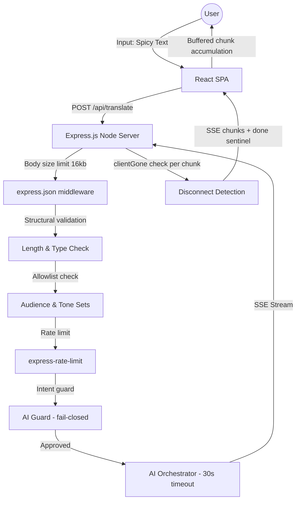
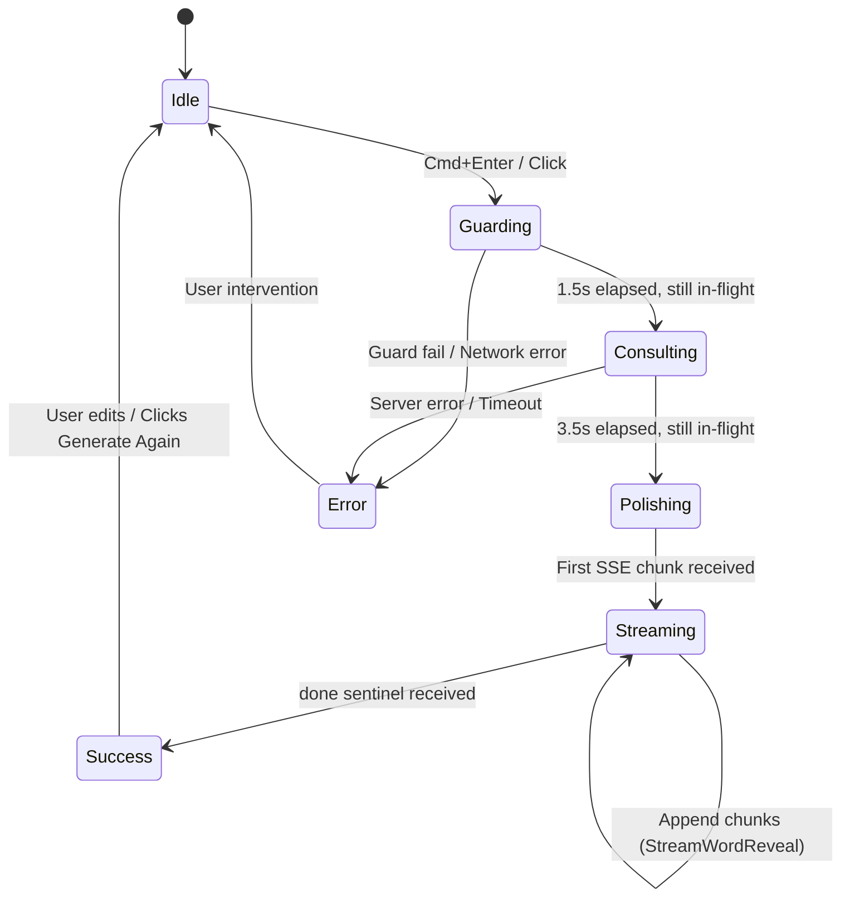
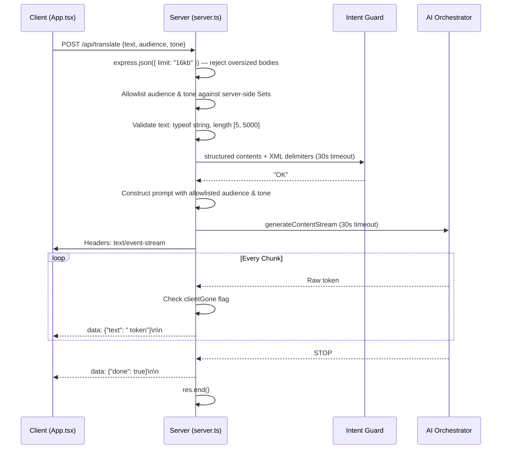
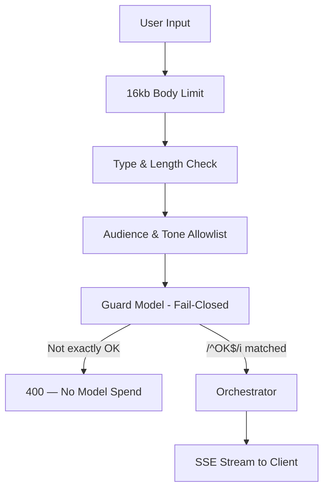
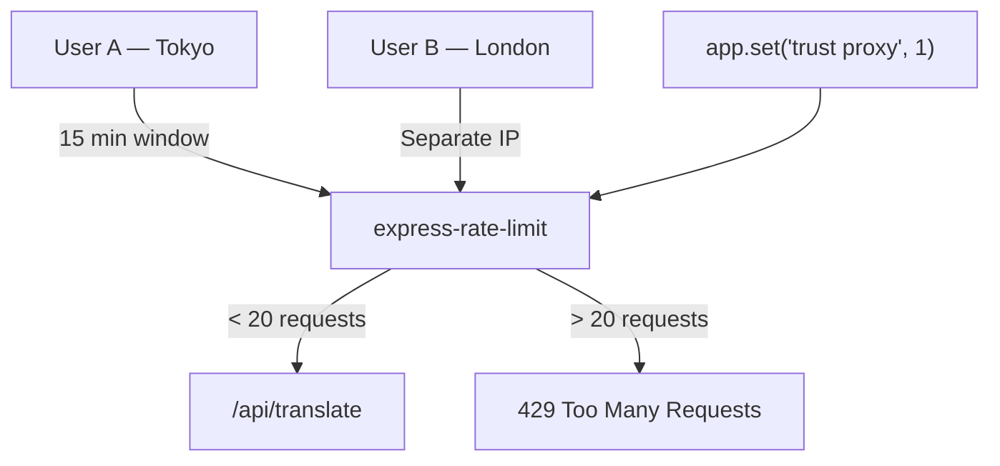
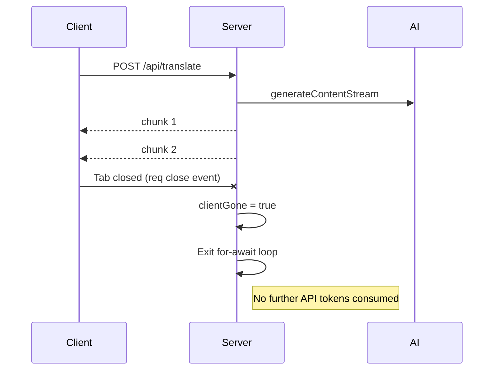
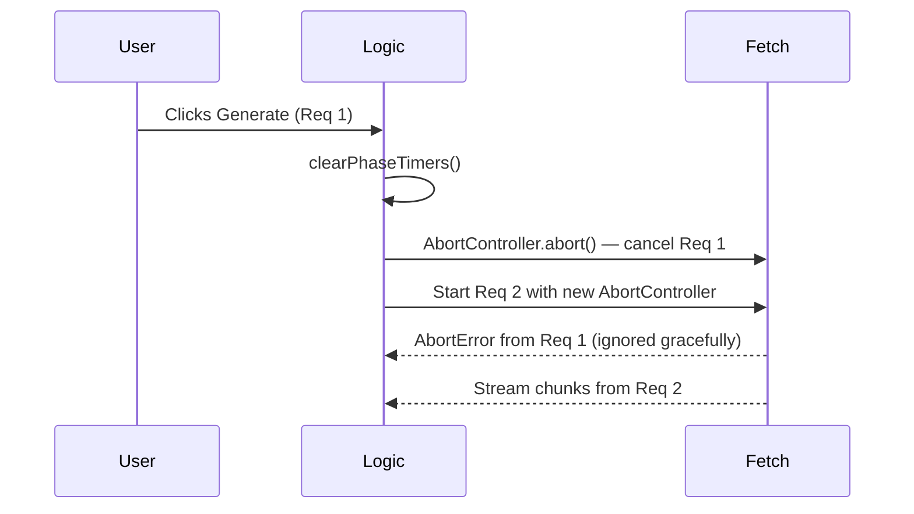
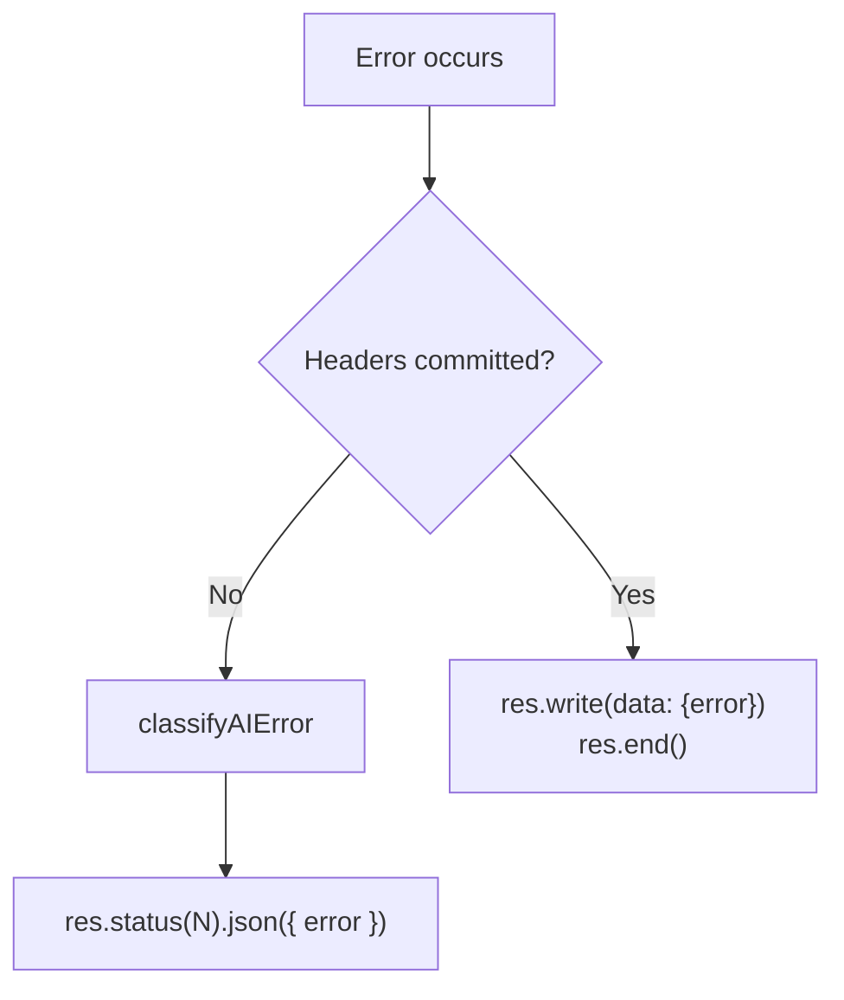

# Spicy-to-Nice Translator

High-trust AI diplomacy engine for transforming blunt, emotional, or overly direct feedback into professional, actionable communication.

This repository is the single source of truth for the current build: a React front end, an Express orchestration layer, and a Flash-tier AI pipeline that treats every request as untrusted until it has cleared structural validation, server-side allowlisting, and an intent guard — in that order, before any model token is spent.

---

## Executive Architectural Overview

The application is intentionally not a generic text rewriter. It is a controlled AI workflow with defense-in-depth at every layer.

| Layer | Responsibility | Why it exists |
| --- | --- | --- |
| Frontend | Collect raw input, surface the model lifecycle, buffer SSE chunks correctly, and keep the user in control | Transparency matters when the system is rewriting human conflict into professional language |
| Backend | Validate, body-limit, allowlist, rate-limit, guard, time-out, detect disconnects, orchestrate, stream | Sensitive AI behavior stays server-side so the API key, allowlists, and policy logic never leave the trust boundary |
| Model layer | Intent guard (fail-closed) plus streaming rewrite | The guard cheaply rejects irrelevant or unsafe input before the expensive rewrite path runs |

The architecture is optimized for two things that are easy to get wrong in AI products: **trust** and **latency**. Trust comes from defense in depth — six independent server-side controls before the model sees user data. Latency comes from a cheap preflight guard and a streamed rewrite rather than a blocking request/response cycle.

---

## Repository Map

| File | Role |
| --- | --- |
| [server.ts](server.ts) | Express server: startup validation, body limiting, allowlist gating, rate limiting, guard pass, AI streaming orchestration, disconnect detection, error classification, health check, and production asset serving |
| [src/App.tsx](src/App.tsx) | React UI state machine: SSE buffer accumulation, phase timer lifecycle, memoized output parsing, diff rendering, copy flow, and revert-to-raw behavior |
| [package.json](package.json) | Scripts and dependency graph for development, build, and production start |
| [vite.config.ts](vite.config.ts) | Frontend build and dev-server configuration |

---

## System Design

### High-Level System Context



The browser never talks directly to the AI model. The model only receives data that has cleared six independent server-side controls.

### Frontend Lifecycle & State Architecture



The UI is a strict state machine. Phase timers are stored in `phaseTimersRef` and cancelled before every new request, on error, and on completion — eliminating the race condition where a stale timer could corrupt the status of a subsequent translation.

### Backend AI Orchestration Pipeline



### Guard Pass Security Model



The guard uses a fail-closed pattern: only an explicit case-insensitive `OK` passes. An empty response (from safety filters), a lowercase variant, or any unexpected output is treated as rejection. Contrast this with a fail-open `startsWith("GUARD_FAIL:")` check, which silently passes anything that isn't exactly that prefix.

### Rate Limiting and Proxy Trust



Without `trust proxy`, the limiter sees the Cloud Run load balancer IP for every request — collapsing all users into one identity and turning rate limiting into a global lockout risk.

### SSE Transport and Disconnect Handling



The server detects client disconnects and exits the streaming loop immediately. Without this, a closed tab causes the server to continue consuming API quota for the full duration of generation.

### Abort and Cancellation Flow



Cancellation is first-class. Stale timers and stale fetch requests are both cancelled before the next request starts.

### Error Recovery Path



If an error occurs after SSE headers have been committed, the server signals it over the stream before closing, rather than attempting a second HTTP response which would throw `ERR_HTTP_HEADERS_SENT`.

---

## Security Controls (In Execution Order)

| Control | Location | What it stops |
| --- | --- | --- |
| Body size limit (16kb) | `express.json({ limit })` middleware | Oversized bodies buffered before validation |
| Structural validation | Route handler | Empty, short, or non-string text |
| Volumetric denial (5000 char) | Route handler | Token abuse, pasted books, bot traffic |
| Audience & tone allowlisting | Server-side `Set` | Prompt injection via parameter tampering |
| Rate limiting (20 req / 15 min / IP) | `express-rate-limit` | Request frequency abuse |
| Guard pass (fail-closed) | AI structured call | Junk input, jailbreaks, off-topic payloads |

**On the audience/tone allowlist specifically:** the model system instruction interpolates these values directly. Without server-side enforcement, a raw `curl` request with `"audience": "ignore all instructions"` would inject that string into the system prompt, bypassing the guard entirely. Frontend validation is UX. Server allowlists are the enforcement boundary.

---

## Resilience Controls

| Control | Location | What it prevents |
| --- | --- | --- |
| `withTimeout()` wrapper (30s) | Both AI calls | Hung API responses exhausting the connection pool |
| `req.on('close')` disconnect detection | Streaming loop | Wasted API quota after client tab close |
| `headersCommitted` flag | catch block | `ERR_HTTP_HEADERS_SENT` flag |
| `classifyAIError()` | catch block | Raw SDK error messages leaking to clients |
| SSE buffer accumulation | `App.tsx` stream reader | Dropped events that span TCP packet boundaries |
| `phaseTimersRef` cleanup | `handleTranslate` | Stale timers corrupting subsequent request state |
| `useMemo` on `parsedOutput` | `App.tsx` | Redundant regex runs on every SSE chunk render |
| `AbortController` reset | `handleTranslate` | Stale request responses writing to active output |

---

## Performance Design

**Guard-first sequencing.** The cheap intent check runs before any rewrite token is spent. A request that would have failed the guard costs one short classification call rather than a full rewrite.

**Streamed rewrite.** The orchestrator response is streamed rather than awaited. The user sees the first tokens within the guard call round-trip, not after the full generation completes.

**Flash-tier models.** Flash-tier AI models are optimized for latency-sensitive interactive use. The model is configurable at deploy time via `GEMINI_MODEL` env var without requiring a code change.

**Why SSE over WebSockets.** The data flow is strictly server-to-client after submission. SSE is lighter, simpler, and does not require session management for this use case. The client reads it as a `ReadableStream` with a proper accumulation buffer.

---

## Output Contract

The backend instructs the AI to emit a structured textual response rather than JSON. Partially complete JSON is unsafe to render during streaming; partially complete text markers degrade gracefully.

```
[DIPLOMATIC_MESSAGE]
(The polished message)

[ACTION_ITEMS]
- (Actionable point 1)
- (Actionable point 2)

[WHAT_CHANGED]
(Summary of what was neutralized and what was preserved)
```

The parser falls back to raw text if no section headers are present — this handles the early streaming window where the model has not yet emitted the first boundary.

---

## Known Gaps

These items are identified, understood, and on the remediation roadmap.

| Item | Impact | Fix |
| --- | --- | --- |
| No HTTP security headers (Helmet) | OWASP exposure (clickjacking, MIME sniffing) | `npm install helmet` + `app.use(helmet())` |
| Unstructured logging (`console.error`) | Unobservable in Cloud Logging | Replace with `pino` structured JSON logger |
| Zero test coverage | No safety net for deployments | Vitest — zero config needed; start with `parseOutput`, allowlist validation |
| Dead diff-view code | "Diff Translation" section shows plain text, not diffs | Wire a diff-aware prompt, or remove `renderTrackedChanges` |
| Monolithic `App.tsx` (451 lines) | All concerns in one component | Extract `useTranslation`, `useClipboard`, `InsightsPanel`, `ControlsBar` |

---

## Getting Started

### Requirements

- Node.js 18+
- A valid `GEMINI_API_KEY` — the server calls `process.exit(1)` at startup if absent

### Development

```bash
npm install
export GEMINI_API_KEY=your_key_here   # or configure via Environment Secrets
npm run dev
```

### Production Build

```bash
npm run build
npm start
```

### Scripts

| Command | Purpose |
| --- | --- |
| `npm run dev` | Express server with Vite middleware in development mode |
| `npm run build` | Vite frontend build + esbuild server bundle to `dist/server.cjs` |
| `npm start` | Run the production server from `dist/server.cjs` on port 3000 |
| `npm run lint` | TypeScript type-check via `tsc --noEmit` |

### Deployment Notes

The service listens on `0.0.0.0:3000` and is designed for containerized deployment on a cloud platform or an equivalent environment.
 In production mode, the server serves the built static frontend assets and the SSE API from the same process. `GEMINI_MODEL` can be set at deploy time to change the model without rebuilding.

---

## Closing Principle

An AI product becomes credible when the system around the model is explicit, defensive, and observable. The frontend makes the workflow legible. The backend limits blast radius and enforces the trust boundary. The model only operates inside a perimeter the application can defend. Every control in this system exists because the alternative — a prototype that passes user input directly to an API — is not a product. It is a liability.
